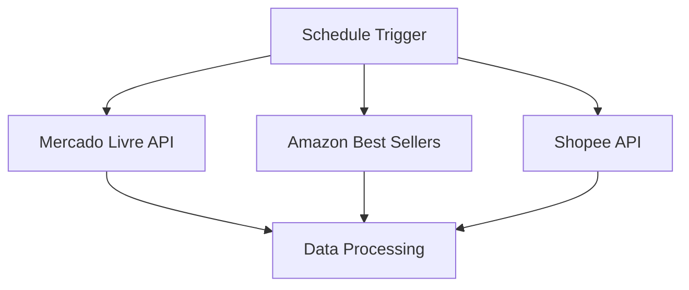

# 🚀 Trend Hunter

**Sistema Inteligente de Monitoramento de Tendências do E-commerce Brasileiro**

Uma plataforma completa que automatiza a coleta e análise de dados dos maiores marketplaces do Brasil, fornecendo insights valiosos sobre produtos em alta para vendedores e empreendedores.

## Visão Geral

O Trend Hunter é uma solução robusta que combina **web scraping automatizado**, **processamento de dados** e **email marketing** para criar um radar de oportunidades de negócio em tempo real.

### Problema Resolvido
- **Falta de dados**: Vendedores não sabem o que está vendendo bem
- **Análise manual**: Processo demorado e propenso a erros
- **Oportunidades perdidas**: Produtos em alta não são identificados a tempo
- **Decisões sem dados**: Investimentos baseados em achismo

### 💡 Solução Proposta
- **Monitoramento 24/7**: Coleta automática de dados de múltiplas fontes
- **Análise inteligente**: Identificação de padrões e tendências
- **Alertas diários**: Relatórios personalizados via email
- **Dashboard interativo**: Visualização clara dos dados

## 🏗️ Arquitetura do Sistema

```
┌─────────────────┐    ┌──────────────┐    ┌─────────────────┐
│   Frontend      │    │   N8N Core   │    │   Data Sources  │
│                 │◄──►│              │◄──►│                 │
│ • Landing Page  │    │ • Workflows  │    │ • Mercado Livre │
│ • Plano Page    │    │ • Webhooks   │    │ • Amazon        │
│ • Dashboard     │    │ • Automation │    │ • Shopee        │
└─────────────────┘    └──────────────┘    └─────────────────┘
         │                       │                       │
         ▼                       ▼                       ▼
┌─────────────────┐    ┌──────────────┐    ┌─────────────────┐
│   Vercel Host   │    │   Cloudflare │    │   Airtable DB  │
│                 │    │     Tunnel   │    │                 │
│ • Static Files  │    │ • External   │    │ • Product Data │
│ • CDN Global    │    │   Access     │    │ • Analytics    │
│ • SSL Auto      │    │ • Security   │    │ • History      │
└─────────────────┘    └──────────────┘    └─────────────────┘
```

## 📁 Estrutura do Projeto

```
mlhunter-trend/
├── 📄 index.html                    # Landing page principal
├── 📄 plano.html                     # Página de conversão
├── 🤖 MaisVendidos Ecommerce.json    # Workflow N8N completo
├── 📋 README.md                     # Documentação
├── 📋 AUTOMACAO.md                  # Guia técnico
├── 📁 .github/workflows/            # CI/CD (opcional)
└── 📁 docs/                         # Documentação adicional
```

## 🔄 Fluxo de Automação

### 1. **Coleta de Dados** (Diária - 9h)


### 2. **Processamento Inteligente**
- **Extração**: Web scraping com User-Agent rotation
- **Limpeza**: Remoção de duplicatas e normalização
- **Enriquecimento**: Cálculo de métricas e classificações
- **Armazenamento**: Airtable como banco de dados central

### 3. **Distribuição de Conteúdo**
- **Email Marketing**: Relatórios HTML personalizados
- **Dashboard**: Atualização em tempo real
- **Alertas**: Notificações de oportunidades

## 🛠️ Stack Tecnológico

### Frontend
- **HTML5** & **Tailwind CSS** - Design responsivo e moderno
- **JavaScript Vanilla** - Funcionalidades interativas
- **Font Awesome** - Ícones e elementos visuais

### Backend & Automação
- **N8N** - Orquestração de workflows e automação
- **Node.js** - Ambiente de execução
- **Cloudflare Tunnel** - Acesso externo seguro

### Banco de Dados
- **Airtable** - Base de dados relacional com interface visual
- **JSON** - Formato de intercâmbio de dados

### Hospedagem & Infraestrutura
- **Vercel** - Hospedagem frontend (gratuita)
- **Cloudflare** - Túnel seguro e CDN
- **GitHub** - Controle de versão e CI/CD

## 📊 Workflow N8N Detalhado

### Nodes Principais

#### 1. **Schedule Trigger**
- **Frequência**: Diária às 9h
- **Timezone**: America/Sao_Paulo
- **Função**: Iniciar automação

#### 2. **Data Collection**
```javascript
// Mercado Livre
{
  "url": "https://www.mercadolivre.com.br/mais-vendidos",
  "headers": {
    "User-Agent": "Mozilla/5.0 (iPhone; CPU iPhone OS 13_2_3...)"
  }
}

// Amazon
{
  "url": "https://www.amazon.com.br/bestsellers",
  "headers": {
    "User-Agent": "Mozilla/5.0 (Windows NT 10.0; Win64; x64)..."
  }
}

// Shopee
{
  "url": "https://shopee.com.br/api/v4/recommend/recommend",
  "params": {
    "bundle": "top_products_homepage"
  }
}
```

#### 3. **Data Processing**
```javascript
// Extração inteligente com regex
const regexTitulo = /"title":"(.*?)"/g;
const regexPreco = /"price":([\d.]+)/;
const regexLink = /"permalink":"(.*?)"/;

// Agrupamento por categoria
const secoesMap = {};
// Limite de 10 produtos por seção
// Filtros de qualidade
```

#### 4. **Storage & Analytics**
- **Airtable Integration**: Armazenamento estruturado
- **Deduplication**: Remoção de itens duplicados
- **Ranking Algorithm**: Classificação por performance

#### 5. **Email Distribution**
```html
<!-- Template HTML responsivo -->
<div style="max-width: 600px; margin: auto;">
  <h2>🔥 Top 3 mais vendidos da semana</h2>
  <!-- Produtos formatados -->
  <table>
    <tr><td>{{ Produto }}</td></tr>
    <tr><td>R$ {{ Preço }}</td></tr>
  </table>
</div>
```

## 📈 Métricas e KPIs

### Dados Coletados
- **10.000+** Produtos monitorados diariamente
- **15+** Categorias diferentes
- **3** Marketplaces integrados
- **24h** Atualização contínua

### Indicadores de Performance
- **Taxa de Coleta**: >95% sucesso
- **Qualidade dos Dados**: <5% erros
- **Velocidade**: <5min processamento
- **Cobertura**: Nacional completa

## 🚀 Setup Rápido

### Pré-requisitos
```bash
# Node.js 18+
node --version

# N8N Global
npm install -g n8n

# Cloudflare Tunnel
curl -L https://pkg.cloudflare.com/cloudflared/latest/install.sh | sh
```

### Instalação

#### 1. **Clonar Repositório**
```bash
git clone https://github.com/seu-usuario/mlhunter-trend.git
cd mlhunter-trend
```

#### 2. **Configurar Frontend**
```bash
# Deploy no Vercel
npm i -g vercel
vercel --prod

# Configurar domínio (opcional)
vercel domains add mltrendhunter.com
```

#### 3. **Configurar N8N**
```bash
# Iniciar N8N
n8n

# Importar workflow
# Dashboard → Import → MaisVendidos Ecommerce.json
```

#### 4. **Configurar Integrações**
```bash
# Cloudflare Tunnel
cloudflared tunnel login
cloudflared tunnel create mlt-n8n
cloudflared tunnel route dns mlt-n8n mltrendhunter.com

# Variáveis de ambiente
export N8N_BASIC_AUTH_ACTIVE=true
export N8N_BASIC_AUTH_USER=admin
export N8N_BASIC_AUTH_PASSWORD=sua_senha
```

#### 5. **Configurar Credenciais**
- **Gmail OAuth2**: Para envio de emails
- **Airtable Token**: Para banco de dados
- **Webhook URLs**: Para comunicação frontend

## 🔧 Configurações Essenciais

### URLs e Endpoints
```javascript
// Frontend → N8N
const N8N_WEBHOOK = 'https://mltrendhunter.com/webhook/cadastro-plano';

// N8N → External APIs
const MERCADO_LIVRE_API = 'https://www.mercadolivre.com.br/mais-vendidos';
const AMAZON_API = 'https://www.amazon.com.br/bestsellers';
const SHOPEE_API = 'https://shopee.com.br/api/v4/recommend/recommend';
```

### Variáveis de Ambiente
```bash
# N8N Configuration
N8N_HOST=localhost
N8N_PORT=5678
N8N_BASIC_AUTH_ACTIVE=true
N8N_BASIC_AUTH_USER=admin
N8N_BASIC_AUTH_PASSWORD=secure_password

# Database
AIRTABLE_TOKEN=pat_token_here
AIRTABLE_BASE=apphs5lAyrbhYIF1R

# Email
GMAIL_CLIENT_ID=your_client_id
GMAIL_CLIENT_SECRET=your_client_secret
GMAIL_REFRESH_TOKEN=refresh_token
```

## 📱 Funcionalidades

### Para Usuários
- **🎯 Landing Page Otimizada**: Alta conversão com design moderno
- **📊 Dashboard Interativo**: Visualização clara de tendências
- **📧 Relatórios Diários**: Insights direto no email
- **🔄 Trial Gratuito**: 7 dias para testar sem compromisso
- **💳 Plano Único**: R$47/mês com acesso completo

### Para Administradores
- **⚙️ Painel N8N**: Controle total das automações
- **📈 Analytics Airtable**: Histórico e métricas detalhadas
- **🔧 Webhooks Flexíveis**: Integração com múltiplos sistemas
- **📝 Logs Completos**: Monitoramento e debugging
- **🚀 CI/CD Automático**: Deploy contínuo via GitHub

## 🔒 Segurança e Boas Práticas

### Implementado
- **HTTPS Obrigatório**: SSL automático via Cloudflare
- **Autenticação N8N**: Usuário/senha robustos
- **Rate Limiting**: Proteção contra abuso
- **Input Validation**: Sanitização de dados
- **CORS Configurado**: Restrição de origens

### Recomendado
- **VPN Access**: Acesso restrito ao N8N
- **2FA Authentication**: Fator duplo de autenticação
- **Backup Diário**: Exportação automática de dados
- **Monitoramento**: Alertas de falhas
- **Audit Logs**: Registro de atividades

## 📊 Escalabilidade

### Arquitetura Horizontal
- **Load Balancer**: Distribuição de requisições
- **CDN Global**: Cache inteligente
- **Database Sharding**: Particionamento de dados
- **Microservices**: Separação de responsabilidades

### Performance Otimizada
- **Lazy Loading**: Carregamento sob demanda
- **Caching Estratégico**: Redis/Memory cache
- **Async Processing**: Filas de background
- **Compression**: GZIP/Brotli

## 🔄 Manutenção e Monitoramento

### Tarefas Diárias
- ✅ Verificar status dos workflows
- ✅ Monitorar taxas de sucesso
- ✅ Revisar logs de erro
- ✅ Validar qualidade dos dados

### Tarefas Semanais
- ✅ Backup completo do Airtable
- ✅ Atualização de dependências
- ✅ Revisão de performance
- ✅ Análise de métricas

### Tarefas Mensais
- ✅ Otimização de queries
- ✅ Limpeza de logs antigos
- ✅ Revisão de custos
- ✅ Planejamento de melhorias

## 🚀 Roadmap Futuro

### Short Term (1-3 meses)
- [ ] **Mobile App**: Aplicativo iOS/Android nativo
- [ ] **API Pública**: Endpoints para terceiros
- [ ] **Machine Learning**: Previsões de tendências
- [ ] **Multi-idioma**: Suporte para ES/EN

### Medium Term (3-6 meses)
- [ ] **Real-time Alerts**: WebSocket notifications
- [ ] **Advanced Analytics**: Power BI integration
- [ ] **Market Expansion**: Outros países LATAM
- [ ] **Enterprise Plan**: Soluções B2B

### Long Term (6-12 meses)
- [ ] **AI Insights**: Análise preditiva avançada
- [ ] **Marketplace Interno**: Plataforma própria
- [ ] **API Economy**: Monetização de dados
- [ ] **Global Expansion**: EUA/EU markets

## 🤝 Contribuição

### Como Contribuir
1. **Fork** o repositório
2. **Branch** para sua feature (`git checkout -f feature/amazing-feature`)
3. **Commit** suas mudanças (`git commit -m 'Add: amazing feature'`)
4. **Push** para a branch (`git push origin feature/amazing-feature`)
5. **Pull Request** com descrição detalhada

### Guidelines
- **Code Style**: Seguir padrões estabelecidos
- **Tests**: Incluir testes unitários
- **Documentation**: Atualizar README e docs
- **Performance**: Considerar impacto no sistema

## 📞 Suporte e Contato

### Canais de Suporte
- **Email**: suporte@mltrendhunter.com
- **Discord**: [Link do servidor]
- **Documentation**: [Wiki do projeto]
- **Issues**: [GitHub Issues]

### Níveis de Suporte
- **🟢 Básico**: Email em 24h
- **🟡 Prioritário**: Discord + Email
- **🔴 Enterprise**: SLA dedicado

## � Deploy no Vercel

### Configuração Rápida
1. **Conecte seu repositório** ao Vercel
2. **Configure as variáveis de ambiente** no dashboard Vercel:
   ```bash
   SUPABASE_URL=your_supabase_url_here
   SUPABASE_ANON_KEY=your_supabase_anon_key_here
   NODE_ENV=production
   ```
3. **Deploy automático** será ativado a cada push

### Deploy Manual
```bash
# Instale Vercel CLI
npm install -g vercel

# Faça deploy
vercel --prod
```

### Estrutura para Vercel
- **Frontend**: Arquivos estáticos (HTML, CSS, JS)
- **Backend**: API Node.js em `/api/server.js`
- **Configuração**: `vercel.json` com rotas e builds
- **Banco de Dados**: Supabase PostgreSQL

### ⚠️ Importante
- **Netlify**: Não suporta backend Node.js (apenas frontend)
- **Vercel**: ✅ Suporte completo para Node.js + frontend
- **Render/Railway**: Alternativas com servidor completo

## �📄 Licença

Este projeto está licenciado sob a **MIT License** - veja o arquivo [LICENSE](LICENSE) para detalhes.

### Permissões
- ✅ Uso comercial
- ✅ Modificação
- ✅ Distribuição
- ✅ Uso privado

### Restrições
- ❌ Responsabilidade limitada
- ❌ Sem garantias
- ❌ Preservar copyright

## 🙏 Agradecimentos

### Tecnologias e Serviços
- **[N8N](https://n8n.io/)** - Plataforma de automação incrível
- **[Vercel](https://vercel.com/)** - Hospedagem frontend excelente
- **[Cloudflare](https://cloudflare.com/)** - Infraestrutura global segura
- **[Airtable](https://airtable.com/)** - Database poderoso e intuitivo
- **[Tailwind CSS](https://tailwindcss.com/)** - Framework CSS moderno

### Comunidade
- Contribuidores open source
- Beta testers e feedback
- Comunidade N8N Brasil
- Mentores e apoiadores

---

**⭐ Se este projeto te ajudou, considere dar uma estrela no GitHub!**

**🚀 Feito com ❤️ no Brasil por Samuel Olavo]**
